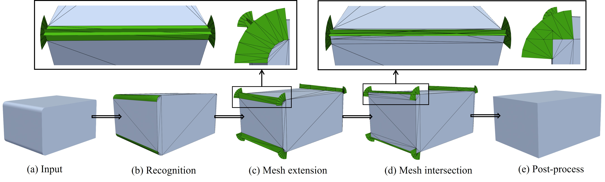

# FilletRec

Code for paper "FilletRec: A Lightweight Graph Neural Network with Intrinsic Features for Automated Fillet Recognition".


## Acknowledgements

This work builds upon several open-source implementations and research efforts. We sincerely thank the authors for their valuable contributions to the community.
- **Project Code**: Modified from [Hierarchical-CADNet](https://gitlab.com/qub_femg/machine-learning/hierarchical-cadnet)
- **Dataset Creation**: Modified from code in `dataset` of [AAGNet](https://github.com/whjdark/AAGNet/blob/main/dataset)
- **Methods' Comparison**: The author of [Defillet](https://github.com/xiaowuga/DeFillet) has helped us run several cases in our paper

## About FilletRec

Automated recognition and simplification of fillet features in CAD models is critical for CAE analysis, yet it remains an open challenge. Traditional rule-based methods lack robustness, while existing deep learning models suffer from poor generalization and accuracy on complex fillets due to their generic design and inadequate training data. To address these issues, this paper proposes an end-to-end, data-driven framework specifically for fillet features. We first construct and release a large-scale, diverse benchmark dataset for fillet recognition to address the inadequacy of existing data. Based on it, we propose FilletRec, a lightweight graph neural network. The core innovation of this network is its use of pose-invariant intrinsic geometric features, such as curvature, enabling it to learn more fundamental geometric patterns and thereby achieve high-precision recognition on complex geometric topologies. Experiments show that FilletRec surpasses state-of-the-art methods in both accuracy and generalization, while using only 0.2\%-5.4\% of the parameters of baseline models, demonstrating remarkable model efficiency. Finally, the framework completes the automated workflow from recognition to simplification by integrating a novel geometric simplification algorithm.

## Preparation

### 1.Requirements
- python >= 3.8
- tensorflow >= 2.13.0
- pythonocc-core >= 7.5.1 (more info here: https://github.com/tpaviot/pythonocc-core.git)
- occwl (more info here: https://github.com/AutodeskAILab/occwl.git)
- numpy
- scikit-learn

### 2.Environment setup

```
git clone https://github.com/Miss-Hedgehog/FilletRec.git
cd FilletRec
conda env create -f environment.yml
conda activate filletrec
```
If the environment.yml installation fails, please install the required packages manually.
### 3.Data preparation

Our synthetic Fillet datasets have been publicly available on [Kaggle](https://www.kaggle.com/datasets/gcujrrly/filletrec). Please read `About Dataset` on [Kaggle](https://www.kaggle.com/datasets/gcujrrly/filletrec) to learn more information about our dataset structure.

## Usage

### 1.Training

For fillet recognition, set `train_set_path` and `val_set_path` in `train.py`, this network can be trained using:

```
python ./train.py
```

The best checkpoint based on the smallest validation loss will be stored in a folder called `checkpoint`, its filename is based on the network's parameter setup and timestamp with the format of `.weights.h5`.

### 2.Testing

For testing on test dataset, set `checkpoint_path` and `test_set_path` in `test.py`, this network can be tested using:

```
python ./test.py
```

### 3.Predicting

To test a single CAD model with a trained network model and save the predicted labels in a `*.step` file to the save directory, please specify `step_dir`, `save_dir`, `step_name`, `checkpoint_path` in `test_and_save.py`, then run:

```
python ./test_and_save.py
```

### 4.Visualizing

A directory of `*.step` files can be viewed using the `visualizer.py` script, in which each label has a unique color. Set `dataset_dir`, then run:
```
python ./visualizer.py
```

### 5.Removing



We propose a three-stage core strategy `Extend-Intersect-Clean` to remove recognized fillets in CAD models.

#### 5.1 Mesh Extending

To extend the boundary mesh, set the `filename` and `step_file` parameters, where the `step_file` should alredy contain the necessary fillet face labels, then run:

```
python ./simplify_fillet_mesh.py
```

In `simplify_fillet_with_mesh()` function, the `offset_dis` parameter controls the mesh extension distance. Based on your specific model, you can check the extended mesh file `*_sim.vtk` to adjust this value. Also, you can adjust the conformality of the mesh by resetting `defletion` parameter.

Sometimes, setting a uniform `offset_dis` for all surfaces may not be suitable, you can modify code of `add_mesh_at_boundary()` function to extend triangle mesh on different surfaces by different distances to accomodate complex fillet types. For example:

```
......
if face_count == face_num:
    offset_distance = distance1

if face_count in [face_num1, face_num2, ... ,face_numx]:
    offset_distance = distance2
......

```
#### 5.2 Mesh Intersecting

The mesh intersection operation in our framework is implemented based on the robust algorithm proposed by by Liu's [Robust and fast local repair for intersecting triangle meshes](https://www.sciencedirect.com/science/article/pii/S0010448525001241), read this paper for more information about mesh intersection.

#### 5.3 Mesh Cleaning

To remove non-manifold structures and isolated components resulting from the intersection, set `filename` and `vtk_file` has be boolean intersected in `delete_boundary_tri.py`, then run:

```
python ./delete_boundary_tri.py
```
After doing all the command mentioned above, the vtk file named `*_result.vtk` is the defilleted result of the CAD model.

